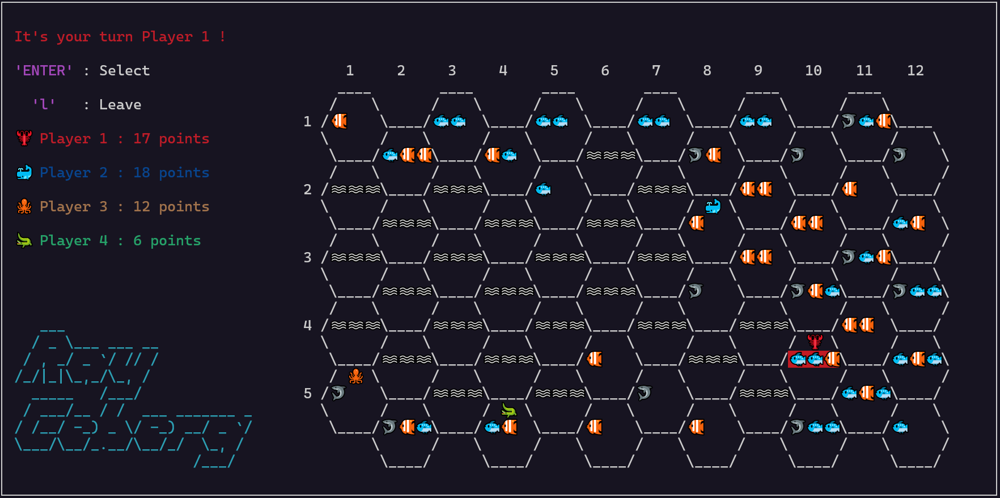
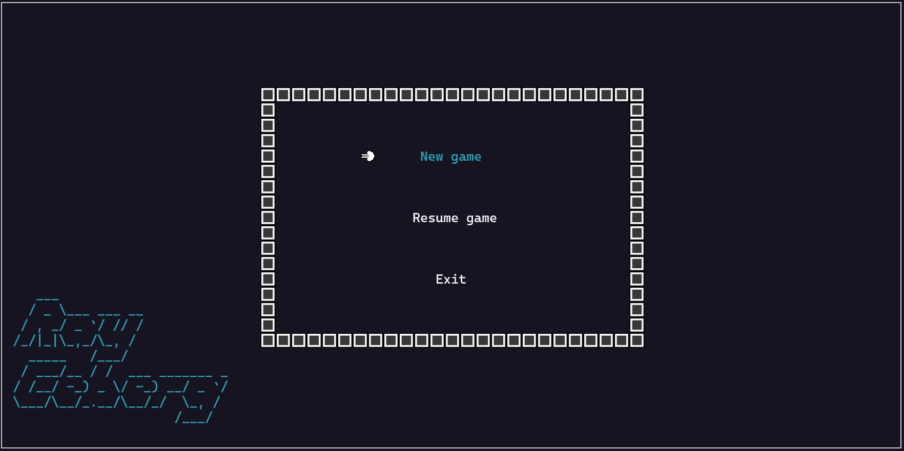

<h1 align="center">🐧 RayCeberg 🐧</h1>



## Introduction

**RayCeberg** is a game I created in C using the `ncurses` library during my first year of preparatory engineering studies to get familiar with the library and programming in C. The game features a grid of icebergs with different types of fish, and the players are randomly placed on icebergs containing only one normal fish. The players wait for their turns and can move from iceberg to iceberg to collect fishes and increase their score. The game ends when all the players can not move anymore.

## Prerequisites

- **C compiler** such as `gcc` is required to compile the game.
- `ncurses` library to manage the game's terminal-based interface.

## Installation

1. **Install the `ncurses` library with the following command :** 
```sh
sudo apt-get install libncurses5-dev libncursesw5-dev libncurses5 libncursesw5
```

2. **Clone the repository :** 
```sh
git clone https://github.com/RayyyZen/RayCeberg.git
```

3. **Move into the project folder :** 
```sh
cd RayCeberg
```

4. **Compile and run the project :**
```sh
make run
```
- **OR**
```sh
make && ./RayCeberg
```

## Game instructions



**Menu options :**
- New game : Start a new game session
- Resume game : Load the last saved game session
- Exit : Quit the game

**Game controls :**
- `ENTER` : Select a menu option or lock an iceberg to move on
- `l` : Leave the game
- `r` : Restart the game
- `a` : Move to north west
- `z` : Move to north
- `e` : Move to north east
- `q` : Move to south west
- `s` : Move to south
- `d` : Move to south east

**Gameplay :**

If your turn has arrived, select an iceberg to land on under the following conditions :

- The chosen iceberg must exist and must not contain any player.
- There must not be any non-existing iceberg or an iceberg with a player on it between the initial iceberg and the chosen iceberg.

The game continues until all players can no longer move. At the end of the game, players are ranked by their scores.

**Types of fishes :**

- ROTTEN : 🦈 (-1 point)
- NORMAL : 🐟 (1 point)
- GOLDEN : 🐠 (2 points)

## License

This project is licensed under the BSD 2-Clause License. See the [LICENSE](LICENSE) file for details.